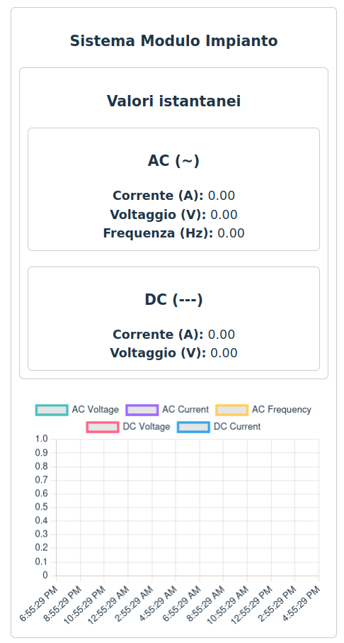
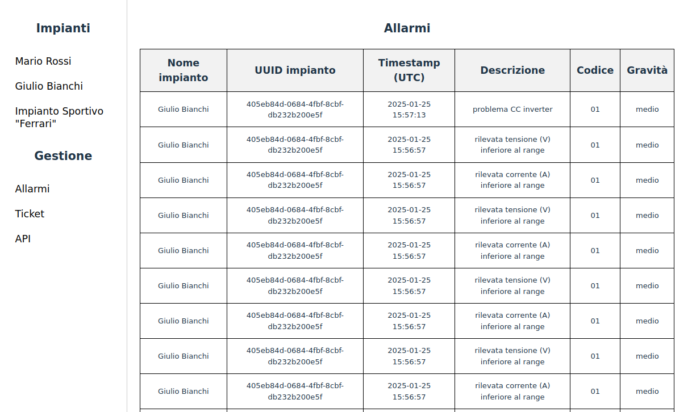
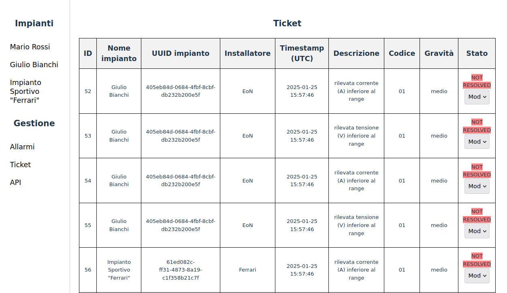
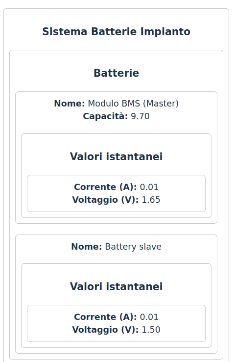
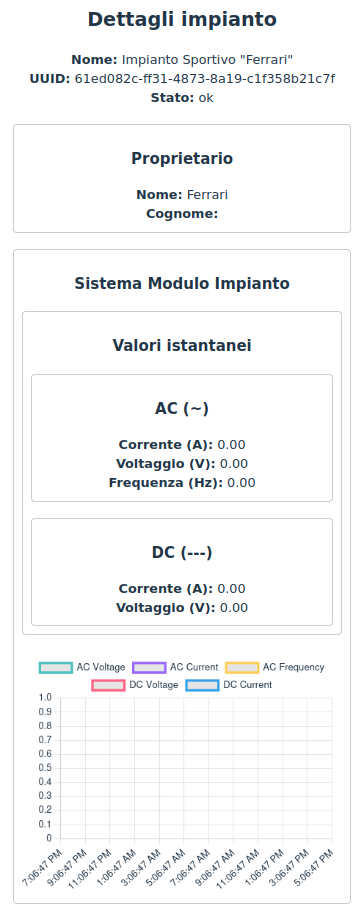
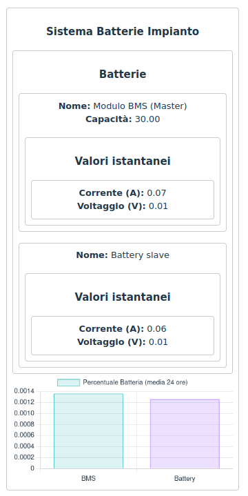

# Report

<!--TOC-->

## Introduzione alla web app

La web app qui presentata è un gestore di dati di impianti fotovoltaici.

Viene tenuto traccia di molti aspetti tra cui i dati produzione di energia
dei pannelli e quelli delle batterie. Ogni dato è visualizzato sia in un
formato instantaneo, sia storico. Tutti questi elementi vengono salvati in un
database relazionale.

La web app fornisce una API REST[^3] per fare in modo che sensori controllati
da microcontrollori, quali ESP32[^5] o Arduino[^6], possano mandare i dati alla
app stessa.

Questa API è inoltre necessaria per far comunicare il frontend scritto in
Svelte[^4], con il backend Python Flask[^9]. Attraverso l'API è possibile
interrogare ogni tabella del database ed estrarre informazioni rilevanti, anche
concatenando una serie di richieste HTTP.

## Script

### Il database

La web app, di per se, non contiene alcun dato all'avvio. Si è optato per un
database relazionale funzionante solo in memoria temporanea (RAM) per questioni
pratiche. Grazie all'utilizzo di SQLAlchemy[^2] è comunque possibile
interfacciarsi con altri sistemi quali PostgreSQL o MySQL semplicemente
cambiando alcune impostazioni.

### Introduzione agli script

Per avere a disposizione dei dati di esempio si è quindi provveduto alla
creazione di alcuni script di popolamento. Nel caso in esame ci sono tre
impianti fotovoltaici:

- *Mario Rossi*
- *Giulio Bianchi*
- *Impianto sportivo "Ferrari"*

Ogni impianto ha dei dati ben specifici in ogni suo elemento.

Alcuni elementi degli impianti, specialmente le letture dei dati dei sensori,
come vedremo in seguito, utilizzano dati pseudo-casuali. 

### Struttura degli script

Quasi tutte le tabelle del database vengono occupate di dati con l'utilizzo
di alcuni script Python. Questi programmi inviano dati alla web app via HTTP
utilizzando il modulo `httpx`[^7], un'alternativa alla più famosa libreria
`requests`[^8].

Un aspetto molto importante è che questi script devono essere lanciati secondo
un ordine ben preciso: infatti, poiché le tabelle del database sono collegate
tra di loro, è necessario prima creare delle istanze di base, per poi passare
a quelle aventi più dipendenze con altre tabelle. Le letture di sensori vengono
lasciate per ultime poiché dipendono dall'esistenza degli impianti e di tutti
gli altri elementi.

## Errori

### Caso standard: assenza di errori

Di base, tutti gli script di popolamento forniscono dati plausibili ed esiste
solo una simulazione di base di alcuni problemi per testare le funzionalità
degli allarmi e dei ticket.

Sulle piattaforme con la shell GNU Bash installata è possibile lanciare i
seguenti comandi per effettuare un avvio completo dell'app. Per prima cosa
bisogna creare e abilitare l'ambiente Python virtuale e installare le
dipendenze. Questo è l'esempio per GNU/Linux:

```shell
python3 -m venv .venv
. .venv/bin/activate
pip install -r requirements.txt
./run.sh
deactivate
```

Per altri sistemi operativi lo script `run.sh` deve essere sostituito con
altri comandi.

### Casi di errore

Per simulare errori più complessi vengono richiamati alcuni script di
popolamento alternativi secondo tre casi, uno per ogni impianto.

Per l'avvio dell'app con i casi di errore è sufficiente cambiare `./run.sh` in
`./run.sh --with-errors` nel comando precedente.

#### Caso 1: problema software impianto *Mario Rossi*

##### Descrizione

L'API riceve dati via HTTP dai microcontrollori in formato errato. Mancano per
esempio dei campi e alcuni di questi hanno dei nomi errati.

\newpage

```python
data = gen_data(readings_per_plant_module_system=1, hours_diff=0)
for d in data:
    if d['plant_module_system_id'] == 1:
        d['voltagee'] = d.pop('voltage')
        del d['current']
```

Per simulare questo errore quindi, consideriamo il dato che sta per essere
inviato, cioè la variabile `d`. Filtriamo per id di sistema-impianto,
estraiamo la chiave-valore `voltage` e la rinominiamo in `voltagee`. Eliminiamo
poi la chiave-valore `current`.

##### Conseguenze

I dati che poi dovrebbero essere visualizzati sul grafico riepilogativo delle
ultime 24 ore sono assenti.

{ width=250px }

L'app, infatti, effettua una validazione dei dai in input dall'API e rifiuta
qualsiasi difformità nella struttura. Questo viene fatto per motivi di
integrità e sicurezza. Qualunque lettura non conforme viene semplicemente
scartata. L'API ritorna un valore HTTP di `400` (bad request) invece che il 
classico `201` (oggetto creato):

{ width=400px }

##### Azioni correttive

Per risolvere questo errore è sufficiente studiare il file delle classi di
validazione JSON, `json_http_schema.py`, presente nella root del progetto.
Questo codice corrisponde solo alla parte per le letture di dati dei sensori.

```python
from mashumaro.mixins.json import DataClassJSONMixin
from dataclasses import dataclass
import classes_orm
import datetime
import typing


@dataclass
class SensorReadingSchema(DataClassJSONMixin):
    voltage: float
    current: float
    frequency: float
    timestamp: datetime.datetime

    def __post_init__(self):
        # Prendi uno dei valori validi dalle enumerazioni.
        valid_values: list[code] =
            [e.value for e in classes_orm.AlarmCode]
        if self.alarm_code not in valid_values:
            raise ValueError(
                f'field "alarm_code" must be one of {valid_values}'
            )


@dataclass
class PlantModuleSystemSensorReadingSchema(SensorReadingSchema):
    plant_module_system_id: int
    alarm_code: typing.Optional[str] = '-01'
```

Queste classi contengono i nomi dei campi e i tipi di dati che l'API si aspetta
e sono collegati agli endpoint di creazione di oggetti.

La libreria mashumaro[^1] permette di validare molto facilmente il payload JSON
dell'API attraverso un meccanismo di *deserializzazione*, cioè decoding, con il
metodo `from_json` della classe `DataClassJSONMixin`:

```python
PlantModuleSystemSensorReadingSchema.from_json(request_data)
```

dove `request_data` è la stringa JSON inviata da remoto.

Si richiede quindi che venga aggiornato il software sui microcontrollori in
modo che rispecchi la struttura corretta che l'API si aspetta dalle letture.

#### Caso 2: problema hardware impianto *Giulio Bianchi*

##### Descrizione

In impianti fotovoltaici di questo tipo possono sorgere problemi hardware
legati per esempio all'usura delle batterie accumulatrici, un po' come avviene
per gli UPS. Può anche capitare che le batterie non vengano caricate a
sufficienza a causa di condizioni metereologiche sfavorevoli per lunghi
periodi. Questo può portare gli accumulatori in uno stato di blocco.

In tutti questi casi si suppone che la carica delle battierie sia molto bassa
o al minimo. Uno degli script simula questo caso:

```python
data = gen_data(readings_per_plant_battery_system=1)
for d in data:
    if d['battery_id'] in [3, 4]:
        d['voltage'] = random.uniform(0.001, 2)
        d['current'] = random.uniform(0.001, 0.01)
```

Le batterie mumero `3` e `4` corrispondono al secondo impianto
*Giulio Bianchi*. In pratica viene fatto un override dei valori generati
casualmente in modo che i dati siano al di sotto dei range minimi.

```python
sensor_reading_range = {
    3: {
        'voltage': {
            'lower': 49.0,
            'upper': 50.0,
        },
        'current': {
            'lower': 10.0,
            'upper': 18.0,
        },
    },
    4: {
        'voltage': {
            'lower': 49.0,
            'upper': 50.0,
        },
        'current': {
            'lower': 13.0,
            'upper': 60.0,
        },
    },
}
```

Questi range sono codificati direttamente nello script di popolamento.

Nei casi normali abbiamo bisogno di dati di esempio plausibili, ma comunque
casuali, all'interno dei range di riferimento.

Per quanto riguarda le batterie, i dati delle letture vengono generati in
questo modo:

```python
voltage = random.uniform(
    sensor_reading_range[battery_id]['voltage']['lower'],
    sensor_reading_range[battery_id]['voltage']['upper']
)
current = random.uniform(
    sensor_reading_range[battery_id]['current']['lower'],
    sensor_reading_range[battery_id]['current']['upper']
)
```

##### Conseguenze

Quando l'API riceve il dato di una lettura di sensori, che sia batteria o
modulo impianto, oltre alla validazione dei dati, vi è anche un algoritmo
per la gestione degli allarmi e dei ticket. Questo è presente nella funzione 
`new_issues` all'interno di `app.py`.

Nell'esempio qui trattato, al contrario del caso 1, l'API accetta tutti
questi dati. A differenza di una lettura con tutti i parametri nella norma
però, in questo caso, il programma generera un'allarme ed apre un nuovo ticket.
I ticket si possono gestire attraverso l'apposita pagina, mentre per gli
allarmi è solo possibile la visualizzazione.

{ width=400px }

{ width=400px }

\newpage

Attraverso la pagina di riepilogo dell'impianto, è possibile vedere i dati
istantanei delle batterie. Si può notare che le letture sono molto vicine allo
zero.

{ width=250px }

##### Azioni correttive

In un conteso reale, per risolvere questo problema è necessario agire sulle
batterie e sui ticket. Normalmente le azioni ordinate da svolgere sono queste:

1. chiamata tecnico manutentore in loco dell'impianto
2. modifica del ticket dallo stato `NOT RESOLVED` a `IN PROGRESS`
3. sostituzione delle batterie, se necessario, o altre manutezioni
4. attesa che i valori delle batterie tornino al range prestabilito
5. chiusura dei ticket collegati al problema segnandoli come `RESOLVED`

Per il punto 5, l'algoritmo dei ticket effettua comunque una chiusura
automatica del problema se nell'ultima ora non si sono più presentati problemi
al componente.

#### Caso 3: combinazione di errori *Impianto Sportivo Ferrari*

Il terzo ed ultimo caso prevede sia la presenza di errori software, sia di
errori hardware. Questi sono stati impostati nello stesso modo dei due
precedenti come evidenziato dalle seguenti figure.

{ width=200px }

\newpage

{ width=200px }

## Conclusioni

In questo report abbiamo visto come la web app gestisce sia gli errori di
natura di interfacciamento con l'API, sia quelli causati da guasti hardware.
Vengono sottolineate le cause, le conseguenze e le possibili soluzioni.

[^1]: [mashumaro: https://github.com/Fatal1ty/mashumaro](https://github.com/Fatal1ty/mashumaro)
[^2]: [sqlalchemy: https://www.sqlalchemy.org/](https://www.sqlalchemy.org/)
[^3]: [API REST: https://it.wikipedia.org/wiki/Representational_state_transfer](https://it.wikipedia.org/wiki/Representational_state_transfer)
[^4]: [Svelte: https://svelte.dev/](https://svelte.dev/)
[^5]: [ESP32: https://www.espressif.com/en/products/socs/esp32](https://www.espressif.com/en/products/socs/esp32)
[^6]: [Arduino: https://www.arduino.cc/](https://www.arduino.cc)
[^7]: [httpx: https://www.python-httpx.org/](https://www.python-httpx.org/)
[^8]: [Requests: https://requests.readthedocs.io/en/latest/](https://requests.readthedocs.io/en/latest/)
[^9]: [Flask: https://flask.palletsprojects.com/en/stable/](https://flask.palletsprojects.com/en/stable/)
